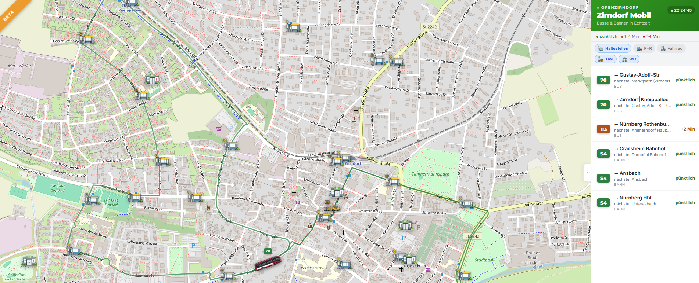

<p align="center">
  
</p>

<h1 align="center">Zirndorf Mobil</h1>

<p align="center">
  Echtzeitkarte des ÖPNV im Zirndorfer Gemeindegebiet —<br>
  Busse, S-Bahn und Regionalbahn live auf der Karte.
</p>

<p align="center">
  <a href="https://mobil.openzirndorf.de"><strong>→ mobil.openzirndorf.de</strong></a>
  &nbsp;·&nbsp;
  <a href="https://openzirndorf.de">Ein Projekt von OpenZirndorf</a>
</p>

<p align="center">
  
  
  
</p>

---



---

## Features

- 🚌 **Live-Positionen** aller Busse (VAG/VGN) und Bahnen (S4, RB11) im Zirndorfer Raum
- ⏱️ **Echtzeit-Verspätungsdaten** via VAG API + DB REST API
- 🗓️ **Fahrplaninterpolation** für S-Bahn und Regionalbahn (GTFS-basiert)
- 🛤️ **Schienenstrecken** exakt entlang der OSM-Gleisgeometrie
- 🏠 **Haltestellenabfahrten** per Klick auf jede Haltestelle
- 📍 **POI-Layer:** Bushaltestellen, P+R, Fahrrad, Taxi, WC
- ⚠️ **Störungsbanner** bei Linien mit hoher Durchschnittsverspätung


## Technologie

| Schicht | Technologie |
|---|---|
| Frontend | React + TypeScript + Vite |
| Karte | Leaflet + OpenStreetMap |
| Echtzeitdaten Busse | VAG VGN API |
| Echtzeitdaten Bahn | DB REST API (v6.db.transport.rest) |
| Fahrplandaten | VGN GTFS Open Data |
| Schienengeometrie | OpenStreetMap / Overpass API |
| POI-Daten | OpenStreetMap / Overpass API |
| Hosting | GitHub Pages |

## Lokale Entwicklung

**Voraussetzungen:** Node.js ≥ 20, pnpm

```bash
# Abhängigkeiten installieren
pnpm install

# GTFS-Daten einmalig aufbauen (dauert ~2 Min, Overpass-Anfragen)
pnpm gtfs

# Entwicklungsserver starten
pnpm dev
```

Die App läuft dann unter `http://localhost:5173`.

### GTFS-Daten aktualisieren

```bash
pnpm gtfs
```

Overpass-Anfragen werden gecacht — bei unveränderter Streckenführung reicht ein erneuter `pnpm gtfs` nach dem Fahrplanwechsel.

## Deployment auf GitHub Pages

### Einmalige Einrichtung

**1. Repository auf GitHub anlegen** (öffentlich oder privat mit Pages-Plan)

**2. GitHub Pages aktivieren:**
Repository → Settings → Pages → Source: **GitHub Actions**

**3. Custom Domain eintragen:**
Repository → Settings → Pages → Custom domain: `mobil.openzirndorf.de`
*(Die `public/CNAME`-Datei ist bereits angelegt)*

**4. DNS-Eintrag beim Domain-Anbieter setzen:**
```
Typ:   CNAME
Name:  mobil
Wert:  <github-nutzername>.github.io
```
Danach kann es bis zu 24 h dauern, bis GitHub das TLS-Zertifikat ausstellt.

**5. Code pushen:**
```bash
git init                          # falls noch kein Git-Repo
git add .
git commit -m "Initial commit"
git remote add origin https://github.com/<nutzer>/<repo>.git
git push -u origin main
```

Der GitHub Actions Workflow (`.github/workflows/deploy.yml`) baut bei jedem Push auf `main` automatisch die GTFS-Daten neu und deployt die App. Laufzeit ca. 2–3 Minuten.

### GitHub Actions Badge einbinden

Nach dem ersten erfolgreichen Deploy den Badge-Link anpassen — in dieser README oben:
```
https://github.com/<nutzer>/<repo>/actions/workflows/deploy.yml/badge.svg
```

### Manuelles Deployment auslösen

Repository → **Actions → Deploy to GitHub Pages → Run workflow**

### Hinweis: gtfs_data.json

Die `public/gtfs_data.json` wird im Workflow bei jedem Deploy neu gebaut. Alternativ kann sie ins Repo eingecheckt werden — dann den `pnpm gtfs`-Schritt im Workflow entfernen.

## Datenquellen & Lizenzen

| Quelle | Lizenz |
|---|---|
| [VGN Echtzeitdaten](https://www.vgn.de/web-entwickler/open-data/) | CC BY 4.0 |
| [VGN GTFS-Fahrplandaten](https://www.vgn.de/opendata/GTFS.zip) | CC BY 4.0 |
| [DB REST API](https://v6.db.transport.rest) | hafas-client (MIT) |
| [OpenStreetMap](https://www.openstreetmap.org) | ODbL |
| [Overpass API](https://overpass-api.de) | ODbL |

## Projektstruktur

```
src/
  App.tsx          # Hauptkomponente, Karte, UI
  api.ts           # VAG/VGN + DB REST API, Positionsinterpolation
  gtfs.ts          # GTFS-Typen, Shape-Matching
  types.ts         # Gemeinsame TypeScript-Typen
  assets/          # Icons (bus.png, sbahn.png, haltestelle.png, …)
scripts/
  build-gtfs.ts    # GTFS-Parser + Overpass-Routing → public/gtfs_data.json
docs/
  screenshot.png   # App-Screenshot für README
public/
  CNAME            # Custom Domain für GitHub Pages
  oz-logo.png      # OpenZirndorf Logo
```
